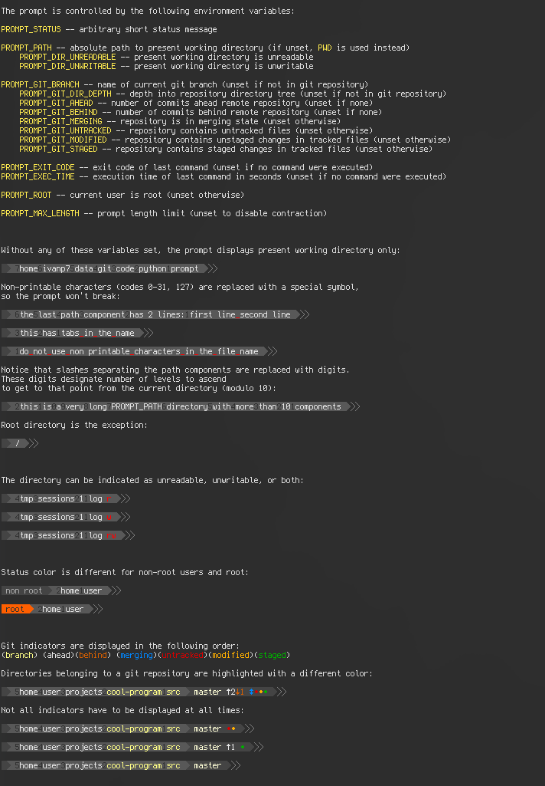
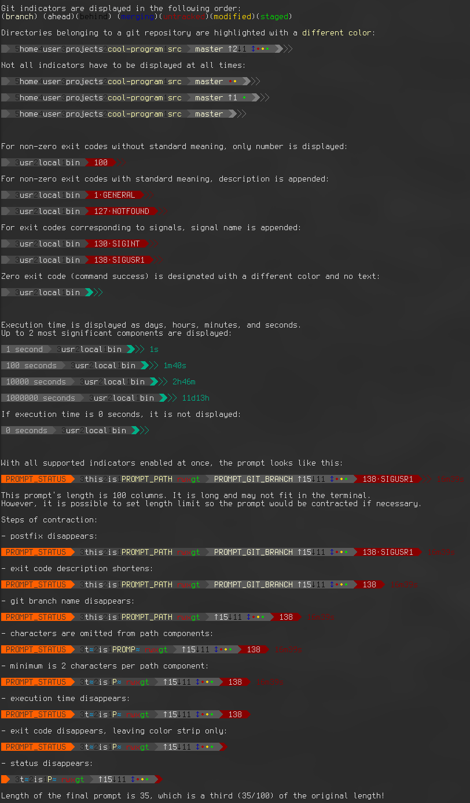

# Simple and informative portable prompt

`STATUS > PATH > [GIT STATUS] > [EXIT CODE] > [EXEC TIME] > POSTFIX`

`STATUS`, `PATH`, `POSTFIX` blocks are always present (unless affected by contraction, see below).

`GIT STATUS`, `EXIT CODE`, `EXEC TIME` blocks are optional and appear only if required.

For full feature demonstration and usage example, run `demo.sh` (not installed with the package).
The output is long, so a terminal multiplexer or a terminal with vertical scrolling is required.
Terminus font or another programming font with extra glyph support is recommended.

Recommended usage of this prompt is to set your shell's own left prompt to empty string,
and print this prompt on a separate line right before the command input line.

`remote.sh` is a helper script doing some of the work for `remote.py`,
setting environment variables for everything except status, path, exit code, and execution time.

## Main features of the prompt

1. Is controlled by environment variables.
The prompt does not analyze shell state by itself,
it only reads and displays values provided to it by environment variables.

2. Is usable as Python module.
The prompt is implemented as a class and accepts all supported input values in its constructor.

3. Is customizable with global variables and style parameter of object constructor.
Prompt colors and characters can be overridden globally and separately for each object.

4. Is adaptive to limited terminal width.
If prompt length exceeds specified limit,
it is contracted in a smart way so the information loss in minimized.

## Screenshots of `demo.sh`

