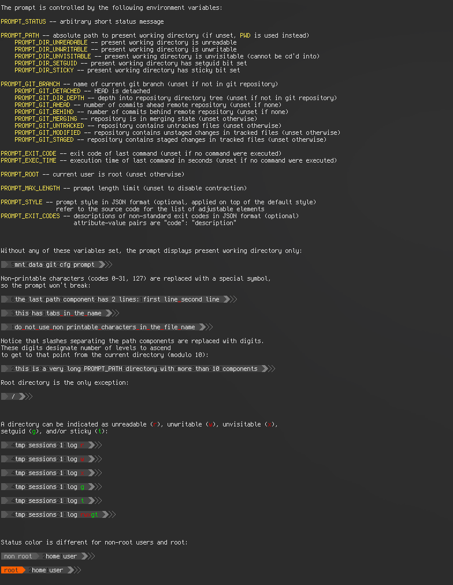
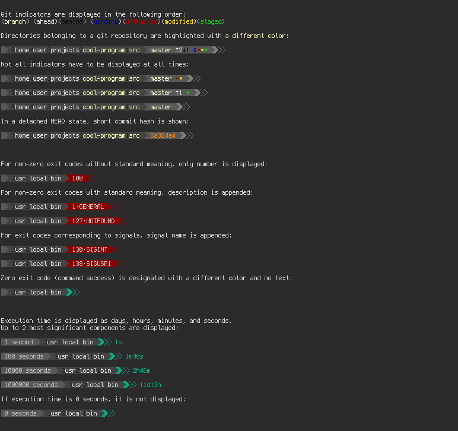

# Simple and informative portable prompt

`STATUS > PATH > [GIT STATUS] > [EXIT CODE] > [EXEC TIME] > POSTFIX`

`STATUS`, `PATH`, `POSTFIX` blocks are always present (unless affected by contraction, see below).

`GIT STATUS`, `EXIT CODE`, `EXEC TIME` blocks are optional and appear only if required.

For full feature demonstration and usage example, run `demo.sh`.
The output is long, so a terminal multiplexer or a terminal with vertical scrolling is required.
Terminus font or another programming font with extra glyph support is recommended.

Recommended usage of this prompt is to set your shell's own left prompt to empty string,
and print this prompt on a separate line right before the command input line.

`remote.sh` is a helper script doing some of the work for `remote.py`,
setting environment variables for everything except status, path, exit code, and execution time.

## Main features of the prompt

1. Is controlled with environment variables.
The prompt does not analyze shell state by itself,
it only reads and displays values provided to it by environment variables.

2. Is customizable with environment variables.
Prompt colors, characters, and behavior can be overridden using environment variables.

3. Is adaptive to limited terminal width.
If prompt length exceeds specified limit,
it is contracted in a smart way so the information loss in minimized.

4. Is usable as Python module.
The module implements a small set of functions.
The default logic is to connect these functions as a pipeline, but it can be changed.

## Screenshots of `demo.sh`

